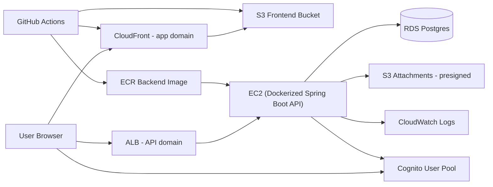
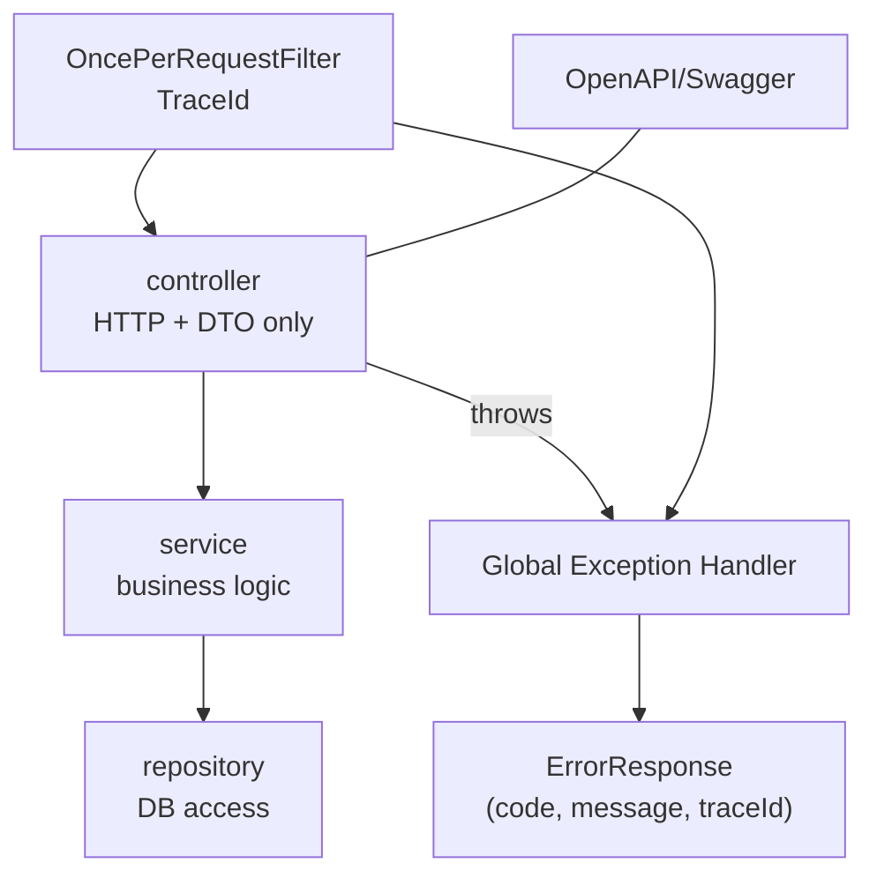

## Architecture

### System Architecture





### Backend Layering

The backend follows a strict layering architecture to ensure separation of concerns and maintainability:

```
┌─────────────────────────────────┐
│      HTTP Layer (Controller)     │  Handles HTTP requests/responses
├─────────────────────────────────┤
│      Service Layer               │  Business logic
├─────────────────────────────────┤
│      Repository Layer            │  Data access
├─────────────────────────────────┤
│      Database                    │  Persistence
└─────────────────────────────────┘
```

#### Layer Responsibilities

##### Controller Layer

- **Package**: `com.jiralite.backend.controller`
- **Responsibility**: HTTP request/response handling
- **Dependencies**: Service layer only
- **Restrictions**:
  - MUST NOT depend on repository layer
  - MUST NOT contain business logic
  - MUST use DTOs for request/response

##### Service Layer

- **Package**: `com.jiralite.backend.service`
- **Responsibility**: Business logic and orchestration
- **Dependencies**: Repository layer, utilities
- **Restrictions**: None

##### Repository Layer

- **Package**: `com.jiralite.backend.repository`
- **Responsibility**: Data access and persistence
- **Dependencies**: Entities only (no service or controller dependencies)
- **Restrictions**:
  - MUST NOT depend on controller layer
  - MUST NOT depend on service layer
  - MUST NOT contain business logic

##### Exception Handling Layer

- **Package**: `com.jiralite.backend.handler`
- **Responsibility**: Centralized exception handling
- **Dependencies**: DTOs, exception classes

##### Filter Layer

- **Package**: `com.jiralite.backend.filter`
- **Responsibility**: Request/response intercepting
- **Dependencies**: None (cross-cutting concerns)

##### Configuration Layer

- **Package**: `com.jiralite.backend.config`
- **Responsibility**: Spring beans and cross-cutting configuration
- **Dependencies**: Utility libraries

#### Enforced Constraints (ArchUnit Tests)

1. Controllers do NOT depend on repositories
2. Repositories do NOT depend on controllers
3. Repositories do NOT depend on services

#### Baseline Flowchart


