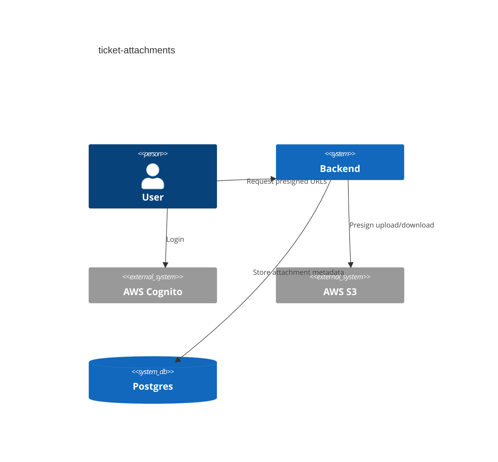
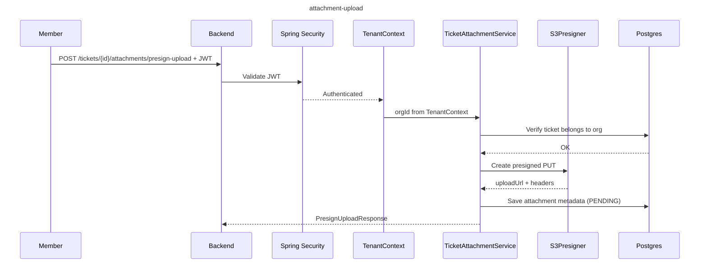

# Ticket Attachments (S3 Presigned)

## Overview

Attachments use S3 presigned URLs for upload and download. The backend stores
metadata and validates tenant ownership.

## C4 Context

## Sequence

