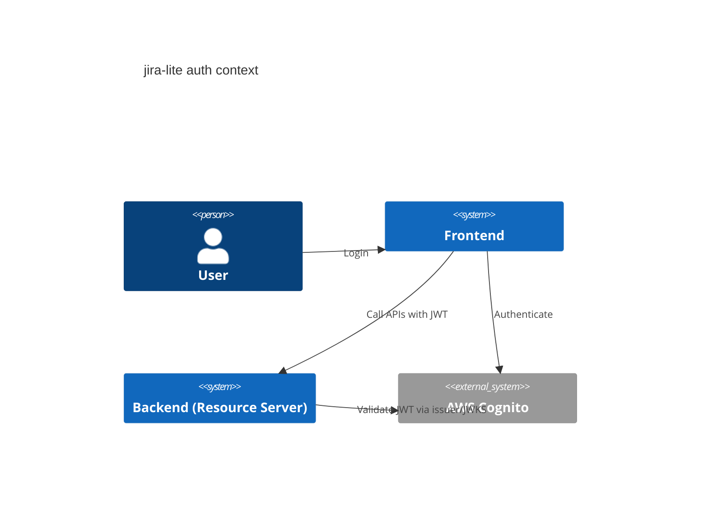
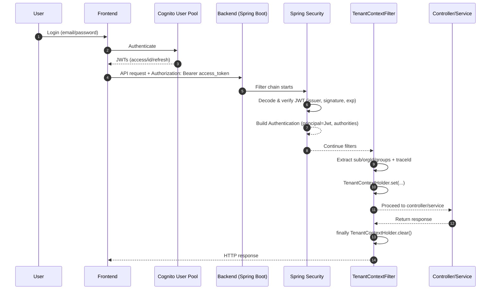

# Auth (Cognito JWT + RBAC)

## Overview

The backend is a Spring Security OAuth2 Resource Server that validates AWS Cognito JWTs.
RBAC is based on Cognito groups and mapped into Spring roles.

## JWT Claims

- **sub**: user id (Cognito subject)
- **custom:org_id**: organization id (configurable via `app.security.org-claim`)
- **cognito:groups**: list of groups used for RBAC (`ADMIN`, `MEMBER`)

## RBAC Mapping

| Cognito Group | Spring Authority |
| ------------- | ---------------- |
| ADMIN         | ROLE_ADMIN       |
| MEMBER        | ROLE_MEMBER      |

## Configuration (Local)

```yaml
spring:
  security:
    oauth2:
      resourceserver:
        jwt:
          issuer-uri: ${COGNITO_ISSUER_URI:https://cognito-idp.<region>.amazonaws.com/<userPoolId>}

app:
  security:
    org-claim: ${ORG_CLAIM:custom:org_id}
```

## Mermaid

### C4 Context



### Sequence


