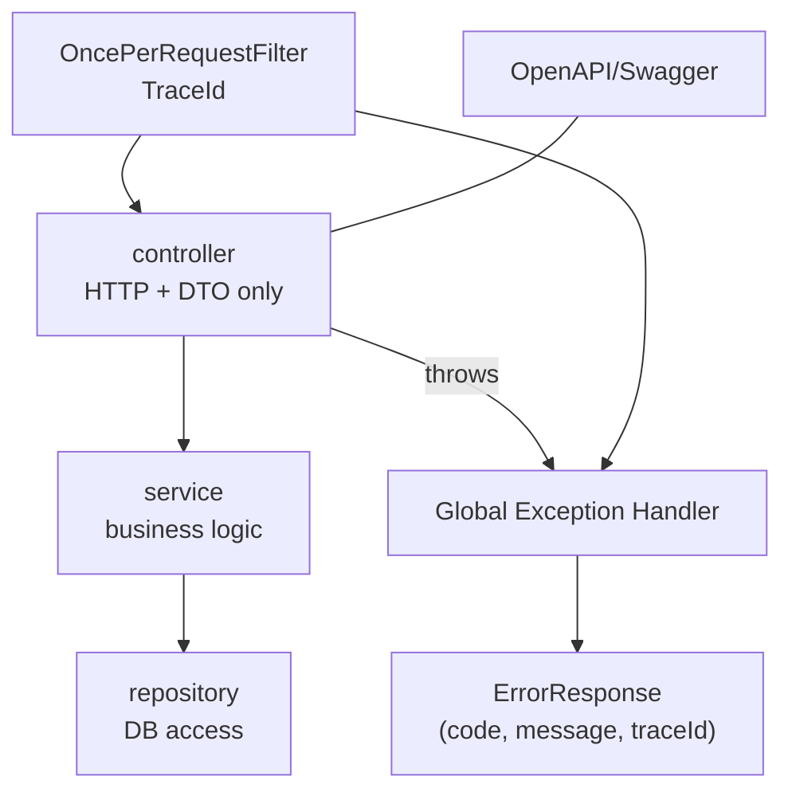

```mermaid

flowchart TB
  C["controller<br/>HTTP + DTO only"] --> S["service<br/>business logic"]
  S --> R["repository<br/>DB access"]
  C -->|throws| EH["Global Exception Handler"]
  EH --> ER["ErrorResponse<br/>(code, message, traceId)"]
  F["OncePerRequestFilter<br/>TraceId"] --> C
  F --> EH
  OA["OpenAPI/Swagger"] --- C

```
