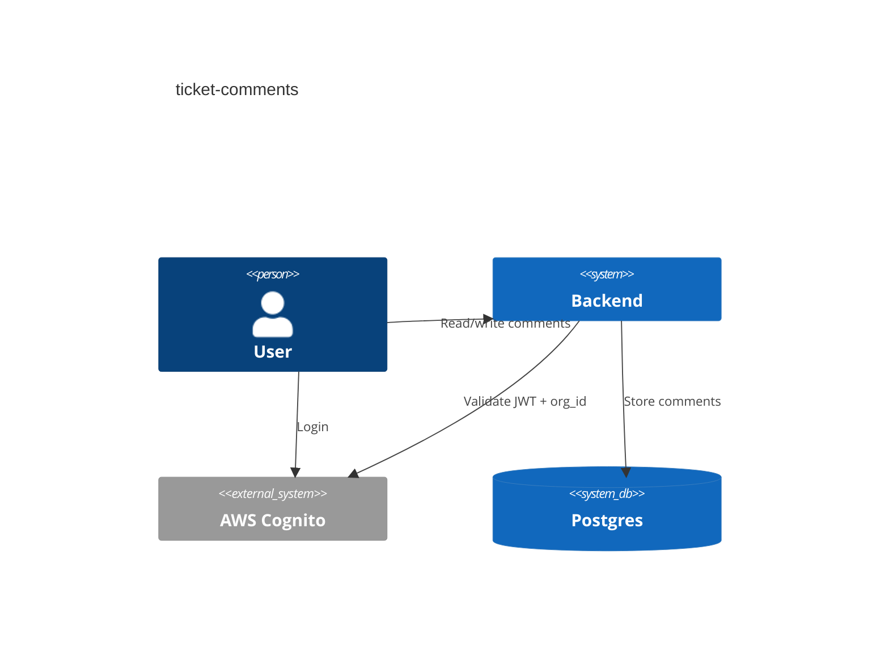
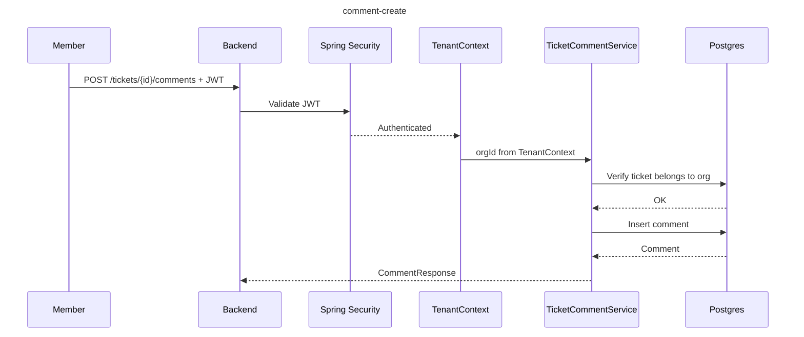

# Ticket Comments

## Overview

Comments are scoped to the current org and ticket. The author is derived from JWT claims.

## C4 Context

```mermaid
C4Context
title ticket-comments
Person(user, "User")
System(be, "Backend")
System_Ext(cognito, "AWS Cognito")
SystemDb(db, "Postgres")
Rel(user, cognito, "Login")
Rel(user, be, "Read/write comments")
Rel(be, cognito, "Validate JWT + org_id")
Rel(be, db, "Store comments")
```

## Sequence

```mermaid
sequenceDiagram
title comment-create
participant U as Member
participant API as Backend
participant SEC as Spring Security
participant TC as TenantContext
participant SVC as TicketCommentService
participant DB as Postgres

U->>API: POST /tickets/{id}/comments + JWT
API->>SEC: Validate JWT
SEC-->>TC: Authenticated
TC->>SVC: orgId from TenantContext
SVC->>DB: Verify ticket belongs to org
DB-->>SVC: OK
SVC->>DB: Insert comment
DB-->>SVC: Comment
SVC-->>API: CommentResponse
```
