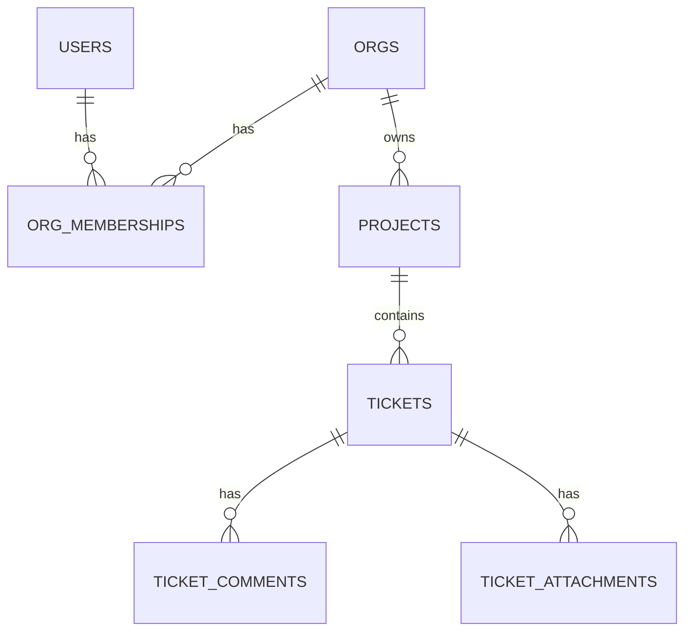

# Database Schema (MVP)

## Goals
- Multi-tenant isolation via `org_id` on tenant-owned tables
- Prevent cross-org references using composite FKs `(org_id, id)`
- Minimal RBAC via `org_memberships.role`: `ADMIN`, `MEMBER`

## ERD

