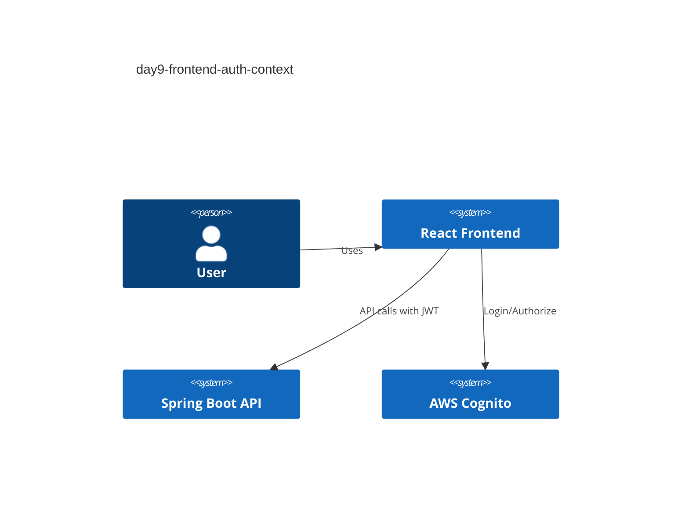
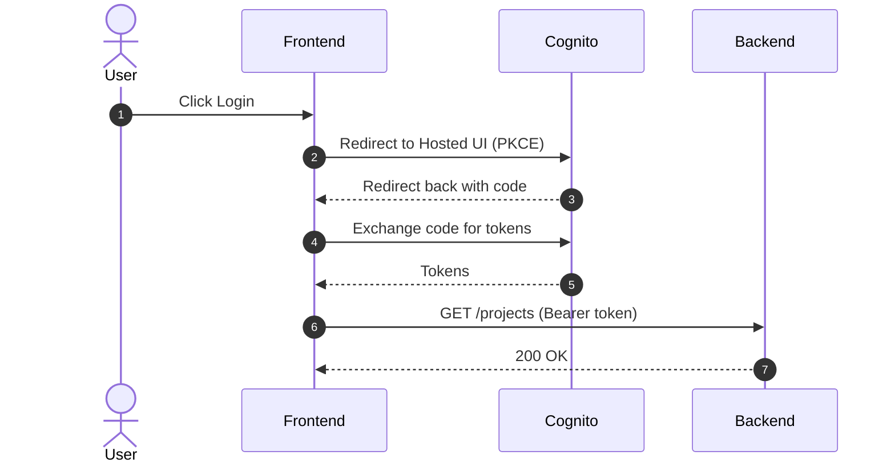

# Frontend Auth (Cognito)

## Overview

Frontend uses Cognito Hosted UI with Authorization Code + PKCE. The app stores the access token and id token in localStorage for MVP and sends the access token as `Authorization: Bearer <token>`.

## Env vars

- `VITE_COGNITO_DOMAIN`
- `VITE_COGNITO_CLIENT_ID`
- `VITE_COGNITO_REDIRECT_URI`
- `VITE_COGNITO_LOGOUT_URI`

## C4 Context

## Sequence (Login)

