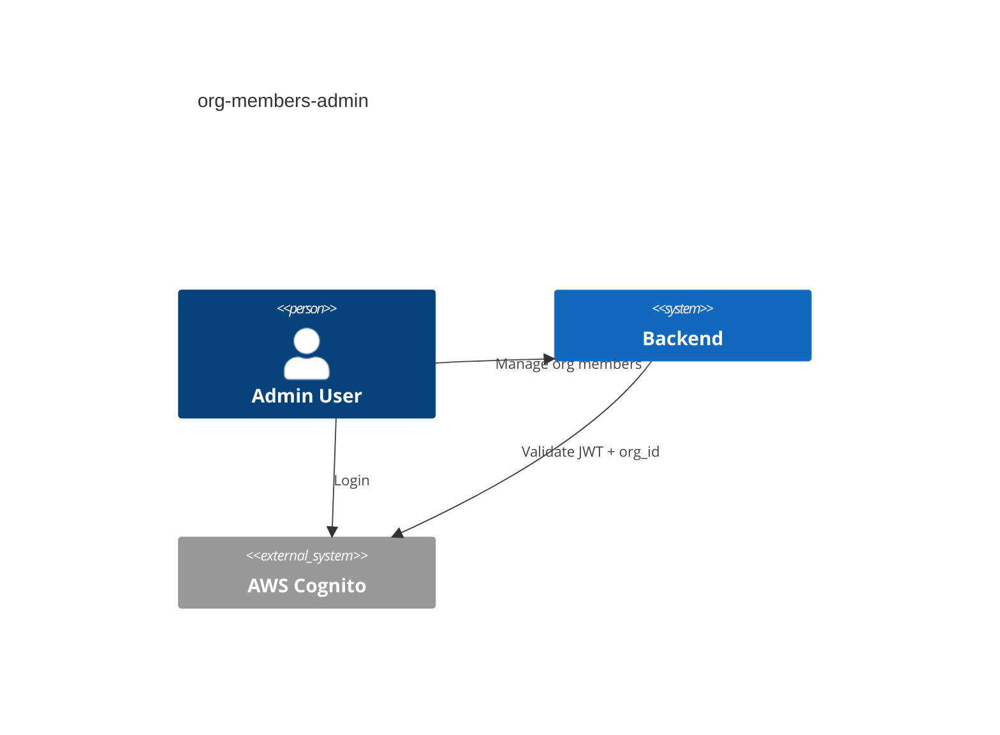
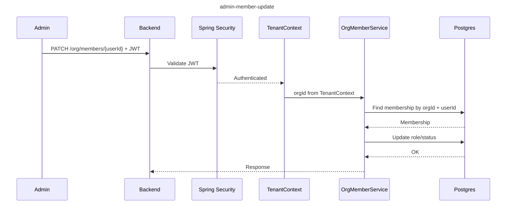
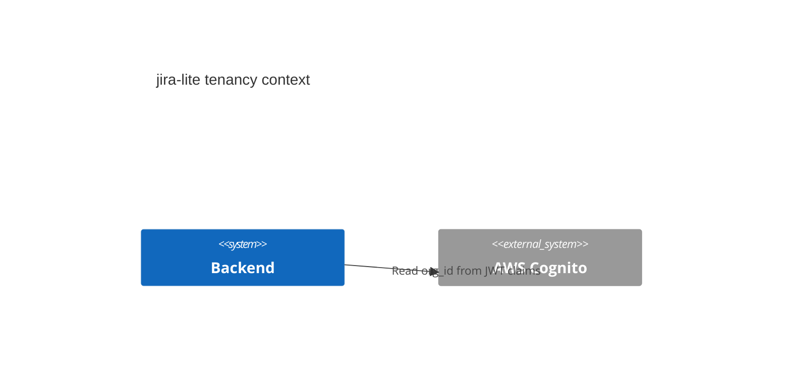
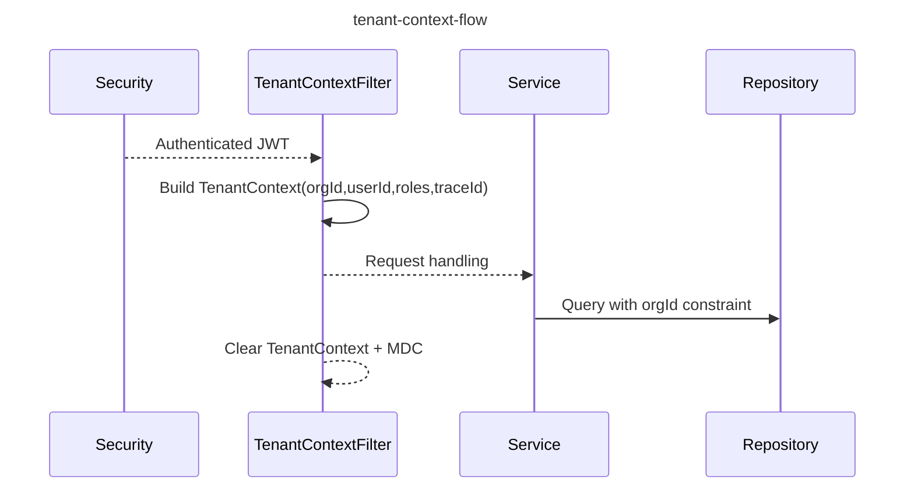

# Multi-Tenancy (TenantContext)

## Overview

Each request derives tenant context from the authenticated JWT.
The context is stored in a ThreadLocal and cleared after the request finishes.

## TenantContext Fields

- **orgId**: from JWT claim `custom:org_id` (configurable)
- **userId**: from JWT claim `sub`
- **roles**: derived from Spring authorities (ROLE_ADMIN/MEMBER)
- **traceId**: from MDC key `traceId`

## Enforcement Rules

- `orgId` must be sourced from JWT claims; never accept `org_id` from clients.
- Services should use `TenantContextHolder.getRequired()` to fetch orgId/userId.
- Repository methods should scope queries by orgId.

## Org Member Management

Admin member management endpoints are scoped to the current org derived from JWT claims.
All membership reads and writes must include `orgId` from `TenantContextHolder`.

## Projects

Project CRUD is tenant-scoped by orgId from the JWT claim. Services must query
projects using `orgId` from `TenantContextHolder` and never accept orgId from clients.

## Tickets

Ticket list/detail/create/update/transition must always scope by `orgId` from
`TenantContextHolder`. Any cross-org access should return 404 to avoid leakage.

## Comments & Attachments

Ticket comments and attachments must verify the ticket belongs to the current org.
All reads/writes must include `orgId` from `TenantContextHolder`.

### C4 Context

### Sequence

## Mermaid

### C4 Context

### Sequence

