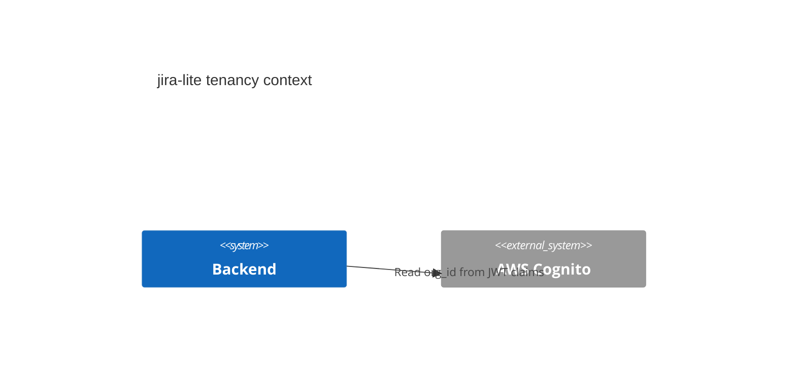
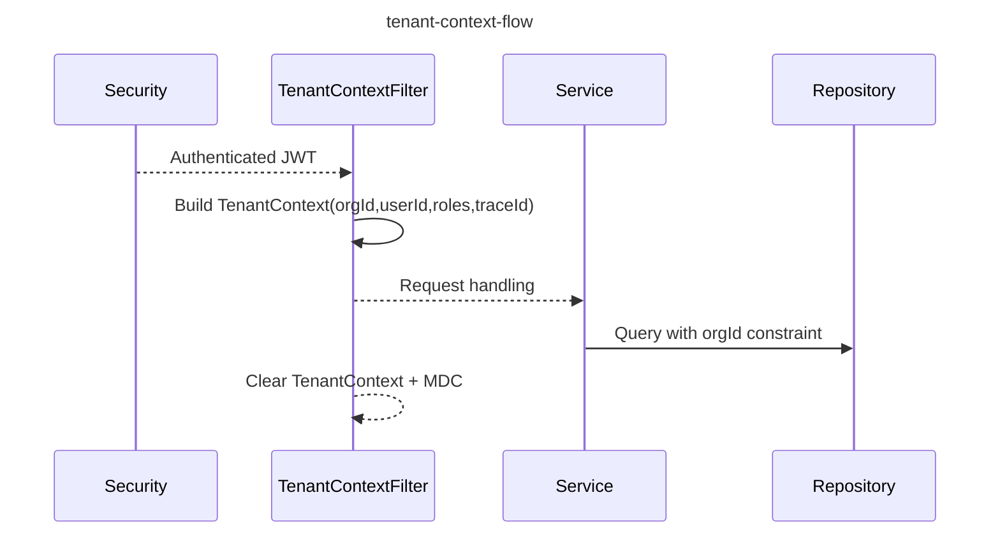

# Multi-Tenancy (TenantContext)

## Overview

Each request derives tenant context from the authenticated JWT.
The context is stored in a ThreadLocal and cleared after the request finishes.

## TenantContext Fields

- **orgId**: from JWT claim `custom:org_id` (configurable)
- **userId**: from JWT claim `sub`
- **roles**: derived from Spring authorities (ROLE_ADMIN/MEMBER)
- **traceId**: from MDC key `traceId`

## Enforcement Rules

- `orgId` must be sourced from JWT claims; never accept `org_id` from clients.
- Services should use `TenantContextHolder.getRequired()` to fetch orgId/userId.
- Repository methods should scope queries by orgId.

## Mermaid

### C4 Context

### Sequence

