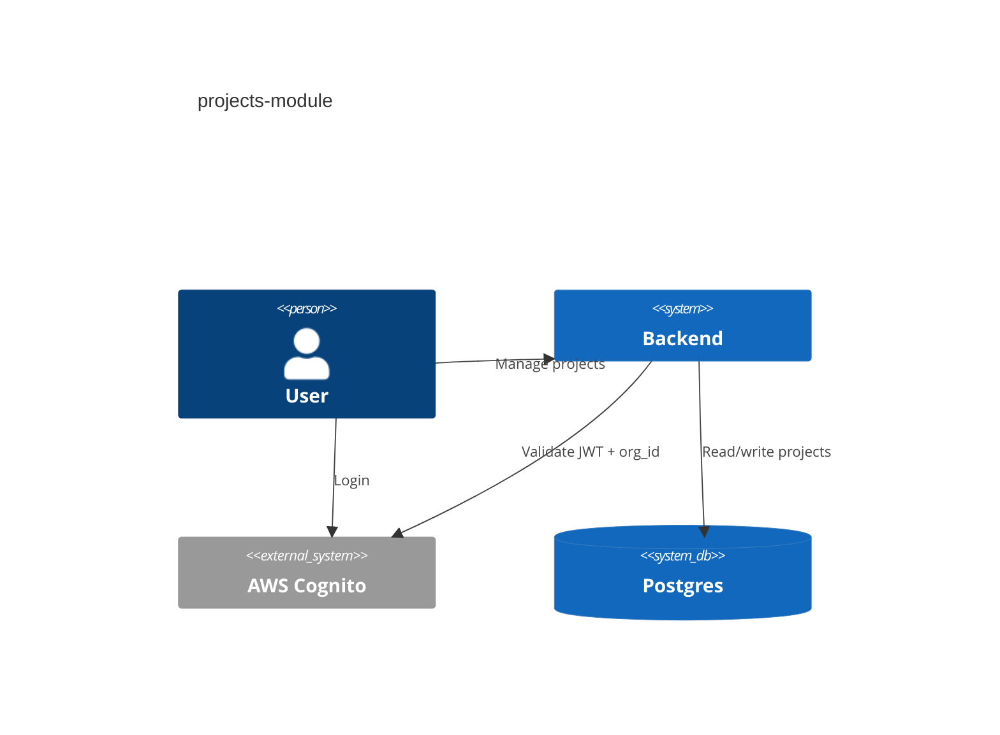
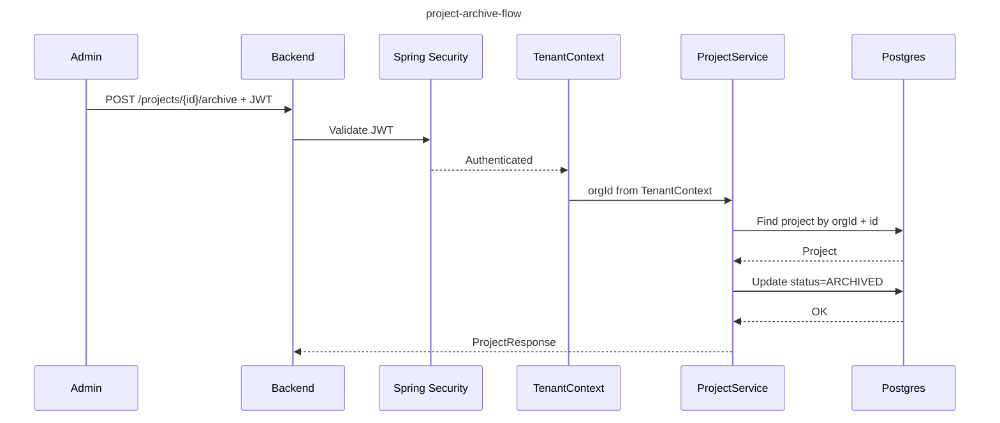

# Projects Module

## Overview

Projects are tenant-scoped resources used to organize tickets. All access is scoped
by `orgId` from `TenantContext`.

## C4 Context

```mermaid
C4Context
title projects-module
Person(user, "User")
System(be, "Backend")
System_Ext(cognito, "AWS Cognito")
SystemDb(db, "Postgres")
Rel(user, cognito, "Login")
Rel(user, be, "Manage projects")
Rel(be, cognito, "Validate JWT + org_id")
Rel(be, db, "Read/write projects")
```

## Sequence

```mermaid
sequenceDiagram
title project-archive-flow
participant U as Admin
participant API as Backend
participant SEC as Spring Security
participant TC as TenantContext
participant SVC as ProjectService
participant DB as Postgres

U->>API: POST /projects/{id}/archive + JWT
API->>SEC: Validate JWT
SEC-->>TC: Authenticated
TC->>SVC: orgId from TenantContext
SVC->>DB: Find project by orgId + id
DB-->>SVC: Project
SVC->>DB: Update status=ARCHIVED
DB-->>SVC: OK
SVC-->>API: ProjectResponse
```
