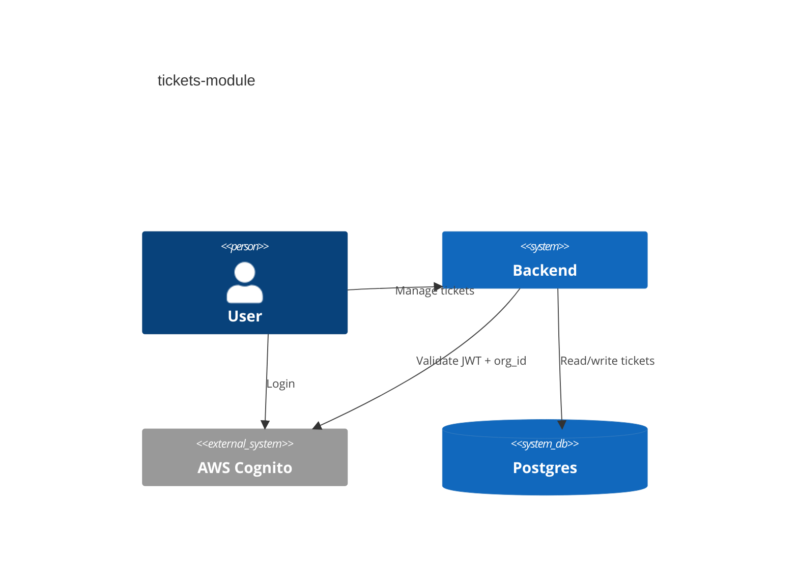
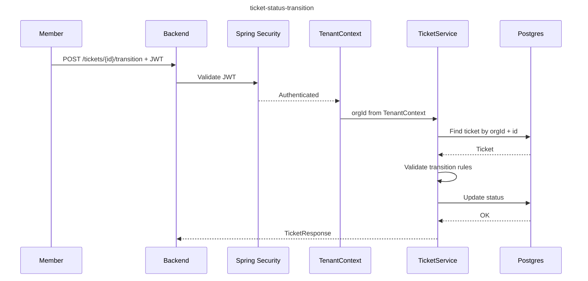

# Tickets Module

## Overview

Tickets represent work items within a project. All access is tenant-scoped by `orgId`
from `TenantContext`.

## C4 Context

```mermaid
C4Context
title tickets-module
Person(user, "User")
System(be, "Backend")
System_Ext(cognito, "AWS Cognito")
SystemDb(db, "Postgres")
Rel(user, cognito, "Login")
Rel(user, be, "Manage tickets")
Rel(be, cognito, "Validate JWT + org_id")
Rel(be, db, "Read/write tickets")
```

## Sequence

```mermaid
sequenceDiagram
title ticket-status-transition
participant U as Member
participant API as Backend
participant SEC as Spring Security
participant TC as TenantContext
participant SVC as TicketService
participant DB as Postgres

U->>API: POST /tickets/{id}/transition + JWT
API->>SEC: Validate JWT
SEC-->>TC: Authenticated
TC->>SVC: orgId from TenantContext
SVC->>DB: Find ticket by orgId + id
DB-->>SVC: Ticket
SVC->>SVC: Validate transition rules
SVC->>DB: Update status
DB-->>SVC: OK
SVC-->>API: TicketResponse
```
